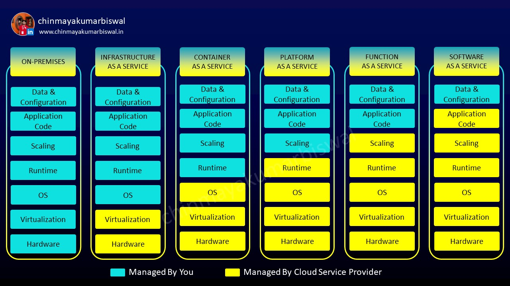

# Basicd of Cloud Computing 
Cloud computing is the on demand delivery of compute resources like Storage, database, networking, etc. 

## Characteristics of Cloud Computing
1. On-demand Self Service
2. Broad Network Access
3. Resource Pooling
4. Rapid Elasticity
5. Measured Services

## Cloud Service Models 
   Cloud service models define the level of abstraction and management of cloud computing services and resources. There are three primary cloud service models:

1. IAAS (Infrastructure as a Service): 
    **Description:** IaaS is the most basic layer of cloud computing. It provides virtualized computing resources over the internet, including servers, storage, networking, and sometimes other infrastructure components like load balancers and firewalls. 

    **Use Case:** IaaS is suitable for users who need control over the infrastructure, such as managing virtual machines, storage, and network configurations. It's often used for hosting and running applications where users have full control over the operating system and software stacks. 

    **Examples:** Amazon Web Services (AWS), Microsoft Azure, Google Cloud Platform (GCP), and IBM Cloud. 

2. PaaS (Platform as a Service): 
    **Description:** PaaS is a higher-level service that provides a platform for building, deploying, and managing applications. It includes infrastructure components but also offers development tools, databases, and middleware to streamline application development. 

    **Use Case:**    PaaS is ideal for developers who want to focus on coding and not worry about the underlying infrastructure. It's commonly used for web and mobile app development and is particularly useful for teams collaborating on software projects. 

    **Examples:**    Heroku, Google App Engine, Microsoft Azure App Service, and Red Hat OpenShift. 

3. SaaS (Software as a Service): 
    **Description:** SaaS is the top layer of cloud computing. It delivers fully functional software applications over the internet on a subscription basis. Users access the software through a web browser, and the provider handles all maintenance and updates. 

    **Use Case:**    SaaS is perfect for end-users who want to use software without the complexities of installation, maintenance, and management. It's commonly used for productivity software, email services, customer relationship management (CRM), and more. 

    **Examples:**    Microsoft Office 365, Salesforce, Google Workspace, Dropbox, and Slack. 

 
  

## Cloud Deployment Models
   Cloud deployment models refer to how cloud computing resources and services are deployed and managed in terms of their location, ownership, and accessibility. There are primarily four cloud deployment models:

1. Public Cloud:  
   **Description:**   In a public cloud deployment, cloud resources and services are owned and operated by a third-party cloud service provider. These resources are made available to the public or multiple organizations. Users access and manage these resources over the internet.
   
   **Use Cases:**   Public clouds are suitable for a wide range of applications and services, including web hosting, email services, software development, and more.
   
2. Private Cloud:  
   **Description:**   Private cloud resources are exclusively used by a single organization. They can be hosted on-premises (on the organization's own hardware and data centers) or off-premises (by a third-party provider). The key feature of a private cloud is that it is dedicated to a single organization, providing greater control and security.
   
   **Use Cases:**   Private clouds are often chosen by organizations with strict security and compliance requirements, such as government agencies, financial institutions, and healthcare providers.
   
3. Hybrid Cloud:  
   **Description:**   A hybrid cloud combines both public and private cloud environments. Data and applications can move between the two cloud models. This allows organizations to take advantage of the scalability and cost-efficiency of the public cloud while keeping sensitive data and critical workloads in the private cloud.
   
   **Use Cases:**   Hybrid clouds are useful when an organization wants to maintain control over some resources while benefiting from the flexibility and cost savings of the public cloud. They are ideal for businesses with variable workloads or specific compliance needs.
   
4. Community Cloud: 
   **Description:**   A community cloud is a shared cloud infrastructure that is used by a specific community of organizations with shared interests or compliance requirements. It can be managed by one of the community members or a third-party provider.
   
   **Use Cases:**   Community clouds are common in industries like healthcare, where multiple organizations need to share data while adhering to regulatory requirements. 
